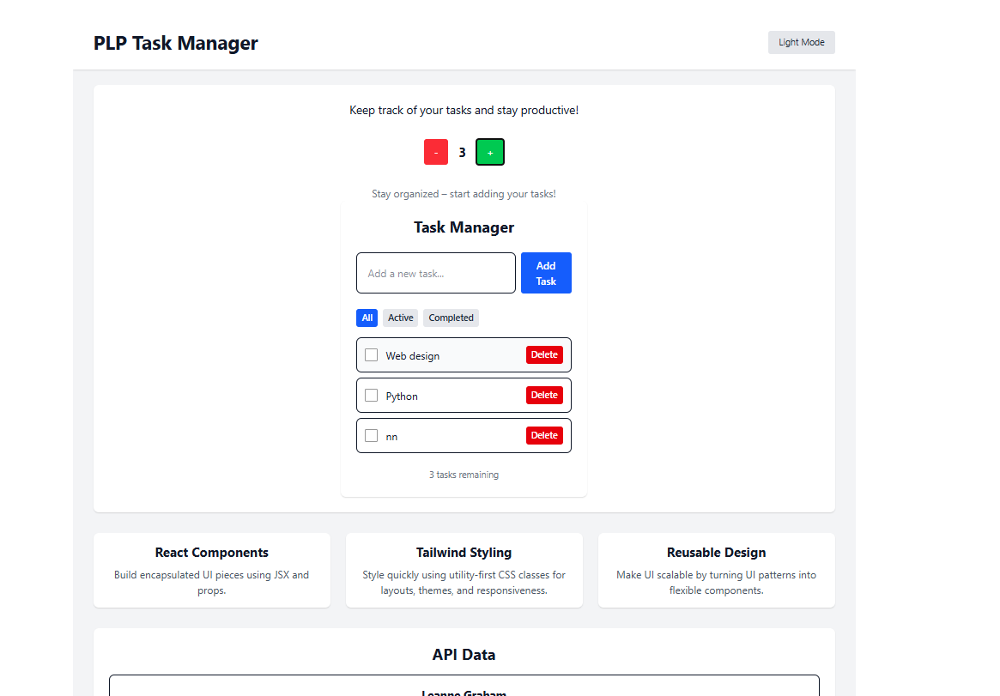
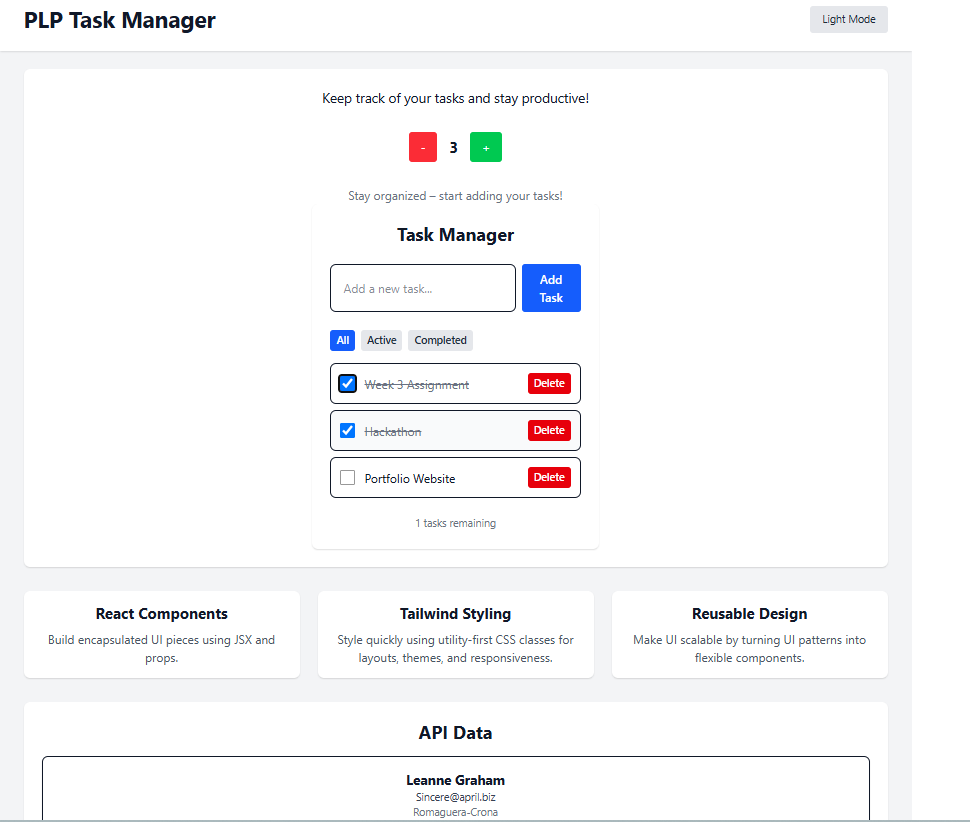
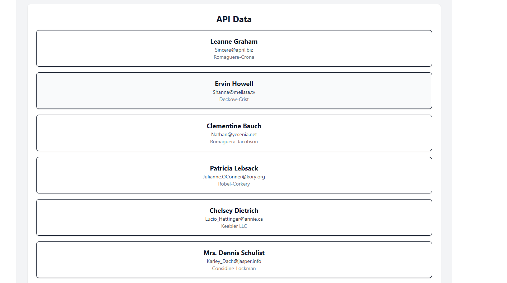
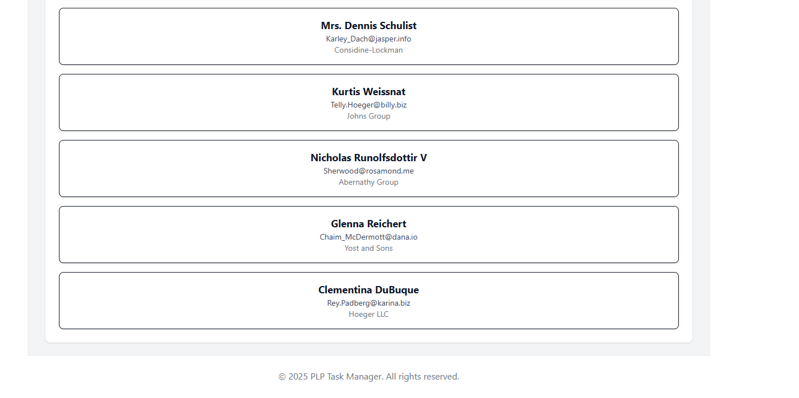

# 📘 PLP Week 3 React Assignment – Task Manager App

This project is a fully responsive and functional **Task Manager** web application built as part of the **Presidential Digital Talent Program (PLP) Week 3 React assignment**. It showcases the use of **React**, **Vite**, **Tailwind CSS**, **React Hooks**, and **Context API**.

🌍 **Live App**: [https://plp-week-3-react-assignment.vercel.app/](https://plp-week-3-react-assignment.vercel.app/)

---

## ✨ Key Features

* ✅ **Add Tasks**: Users can input and add tasks with a single click.
* ✅ **Mark as Completed**: Tasks can be marked as completed using a checkbox.
* ✅ **Delete Tasks**: Tasks can be deleted instantly.
* ✅ **Task Filtering**: View tasks by All, Active, or Completed state.
* ✅ **Theme Toggle**: Switch between Light and Dark mode using a global context.
* ✅ **Data Persistence**: Tasks are saved using `localStorage` so they persist after reloads.
* ✅ **Reusable Components**: Buttons, Cards, Navbar, Footer and TaskItem components are modular.
* ✅ **Custom Hook**: `useLocalStorageTasks` to encapsulate localStorage logic.
* ✅ **External API Integration**: Fetches and displays user data from the JSONPlaceholder API.
* ✅ **Mobile-First Responsive Layout**: Adapts to mobile, tablet, and desktop screens.

---

## 📁 Project Structure

```bash
plp-week-3-react-assignment/
├── public/               # Static files
├── src/
│   ├── components/       # Reusable components like Button, Card, TaskManager, Navbar, Footer
│   ├── context/          # ThemeContext (light/dark mode)
│   ├── hooks/            # Custom hook: useLocalStorageTasks.js
│   ├── App.jsx           # Main component layout and routing
│   ├── main.jsx          # App entry point with ThemeProvider
│   └── index.css         # TailwindCSS & global styles
└── README.md             # Project documentation
```

---

## 🚀 Technologies Used

* ⚛️ [React](https://reactjs.org/) – Component-based UI
* ⚡ [Vite](https://vitejs.dev/) – Fast build tool for modern apps
* 🎨 [Tailwind CSS](https://tailwindcss.com/) – Utility-first CSS for styling
* 🌑 [React Context API](https://reactjs.org/docs/context.html) – For theme state
* 📦 [localStorage API](https://developer.mozilla.org/en-US/docs/Web/API/Window/localStorage) – Task persistence
* 🌐 [JSONPlaceholder API](https://jsonplaceholder.typicode.com/users) – Dummy user data for API integration
* ☁️ [Vercel](https://vercel.com/) – Deployment

---

## 🧪 Setup Instructions

1. **Clone this repository**

```bash
git clone https://github.com/anyangumajimbo/plp-week-3-react-assignment.git
cd plp-week-3-react-assignment
```

2. **Install dependencies**

```bash
pnpm install
```

3. **Run the development server**

```bash
pnpm run dev
```

4. **Build for production**

```bash
pnpm run build
```

5. **Preview production build locally**

```bash
pnpm run preview
```

---

## 🔧 Available Scripts

* `pnpm dev` – Start development server
* `pnpm build` – Build the app for production
* `pnpm preview` – Preview the production build locally

---
## 🖼️ Screenshots

### 🌞 Light Mode


### ✅ Task Manager in Use


### 🌐 API Data Display




---

## 👨‍💻 Author

**Anyangu Majimbo**
PLP Software Engineering Program – 2025 Cohort
GitHub: [@anyangumajimbo](https://github.com/anyangumajimbo)
Live Site: [https://plp-week-3-react-assignment.vercel.app/](https://plp-week-3-react-assignment.vercel.app/)

---

## ✅ Status

This project is **complete**, deployed, and meets all Week 3 objectives:

+ [x] Add / Complete / Delete tasks
+ [x] Filter tasks (All, Active, Completed)
+ [x] Persist data with localStorage
+ [x] Theme toggle with Context API
+ [x] Custom hooks
+ [x] Fetch and display API data
+ [x] Responsive UI (mobile + desktop)
+ [x] Code pushed to GitHub
+ [x] Project deployed via Vercel


---

## 📬 License

This project is part of a learning assignment and is publicly available for educational use.
